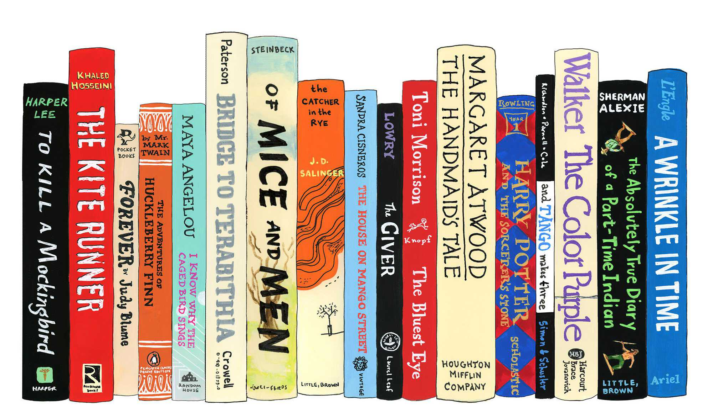

# Project Module 2
# Power BI Dashboard TOP BOOKS RATINGS

This dashboard will help publisher to define which genres and subgenres are most popular and best rated, with this, they can try to find and publish more of this type of books.
For readers who want to find a book to read, this dashboard will help them find best rated books and authors and their genres and subgenres, so they may be interested in reading any of this books.
### :information_source: **Introduction**
Through this dashboard you will find an analysis of the highest rated books, based on number of reviews, genre and years from 2000 to 2020.
So, you will be able to find the top ten most read books, find the most read by genre or the most read in a specific year from 2000 to 2020.
### :baby: **Specifications**
This is an Ironhack Data Analytics Bootcamp Final Project.  Module 2. 
TOP BOOKS RATINGS provides analysis:
-	Giving you the top ten highest read books.
-	Allowing you to find the most read books by genre.
-	Checking the best rated authors and the genres they write.
### :bulb: **Functional design mockup**

### :bulb: **Data model**

### :computer: **Technologies**
- Python
- Jupyter Notebook
- Pandas
- Numpy
- Power Bi
### :love_letter: **Conclusions**
The genres most read and best rated are Fantasy, Mystery and Nonfiction, therefore, publishers may want to try and publish more books of these genres. Is important to notice that Young Adult books of this main genres are most read and valued, it is a very important subgenre to take into account.
Special notice to Graphic Novels which are very well valued and read by many people, is a genre that is growing fast.
